__Occupation:__ MS Data Analytics Student at Oregon State University

__Location:__ Colorado Springs, Colorado

__Hobbies:__ 3D Printing, Cani-cross, Bodybuilding.

__Background:__ From the time I could legally work, that's mostly all I've ever done. I spent my summers working at parks, banks, and barns near my my very small hometown. After highschool, I spent the next 4 years working at various retail locations before deciding it was time to get a degree. The following college summers I ended up falling into the family business of tree logging until I was able to attend Humboldt State University fulltime. I received my degree in geology and set out to be the best damn geologist there ever was...but ended up in engineering. 

My first year after graduating, I worked as a seismic observer for a small seismic exploration company out of Traverse City, Michigan. For the following two years, I worked for a civil engineer out of Redding, California doing various AutoCAD design projects for commercial buildings, cannabis grows, and retail pads. I developed a real knack for environmental compliance and writing permits from scratch at that job. In the summer of 2018 I was offered a job at Liberty Oilfield Services as a Field Engineer. I packed up and moved to Wyoming where I spent another two years learning to hate the cold and snow. When COVID hit, it temporarily devastated the oil and gas industry, and I was subsequently laid off in April 2020. 

However, it was this field job that got me very interested in data science. I had taken on a breakout project doing data mining, cleaning, and presenting information about the SCOOP/STACK basin out of Oklahoma. It was this project where I learned how much I didn't know you could do with data. Not to mention the MASSIVE amount of data I was manually collecting and reporting every hour on the hour that I was in the field - it blew my mind and I knew I had to learn more.

Now, here I am more than halfway done with my masters degree studying all the ways I can use data to learn more about the word, at the end of 2021.

Here are some pictures of me and things I enjoy. 

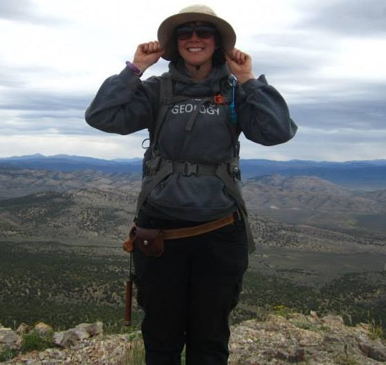
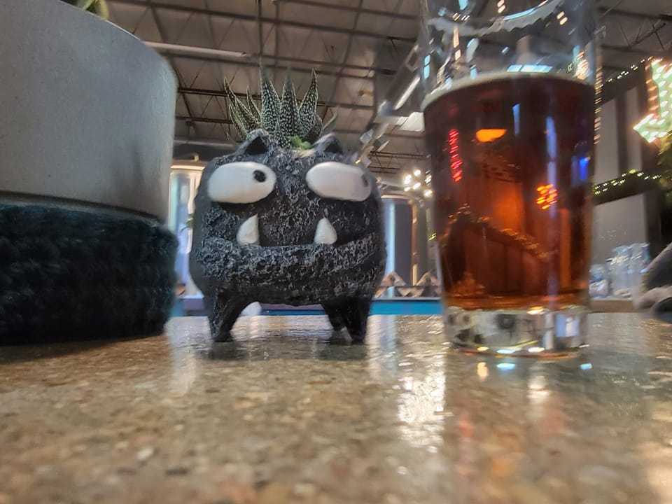
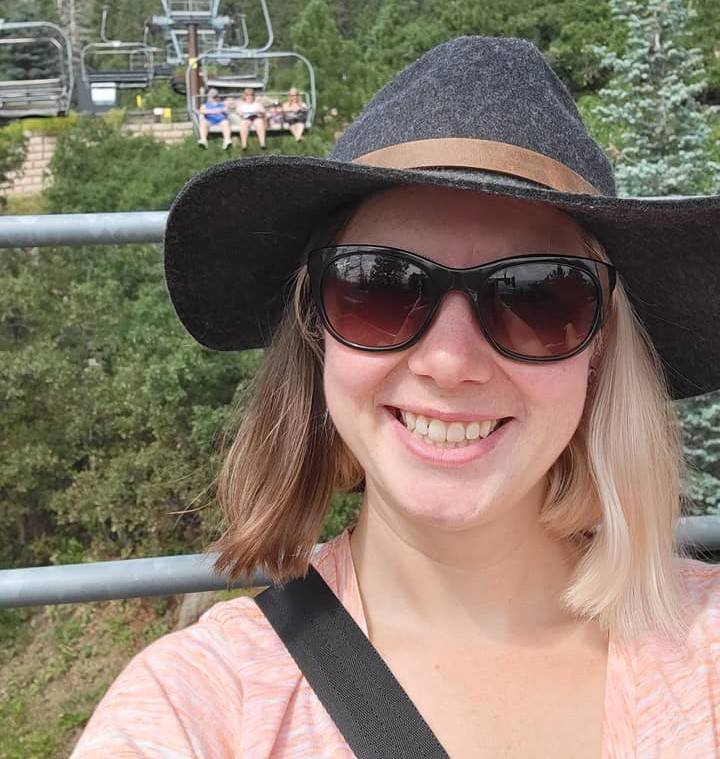
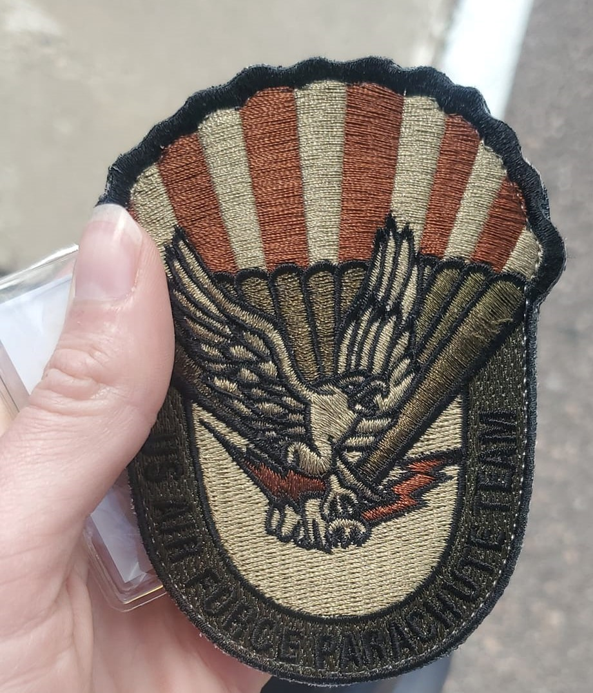

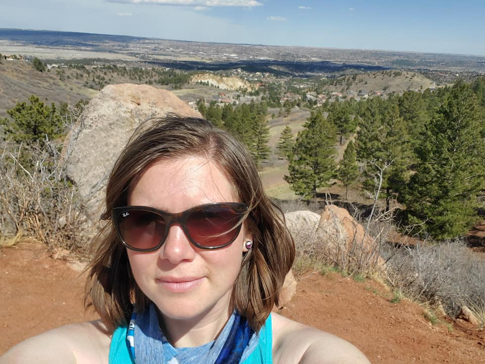

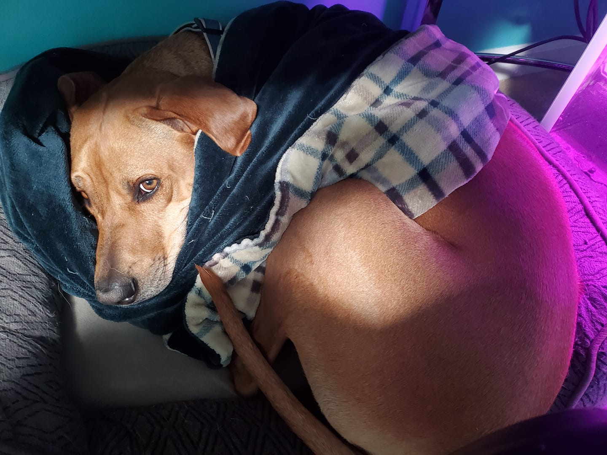
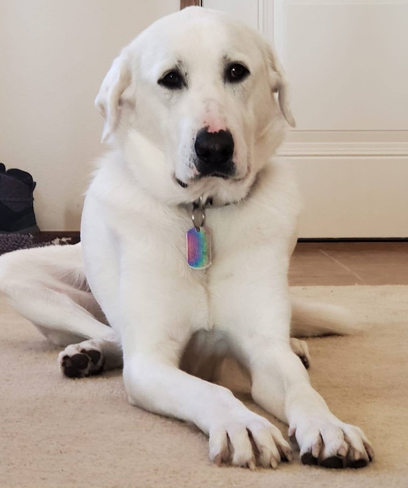
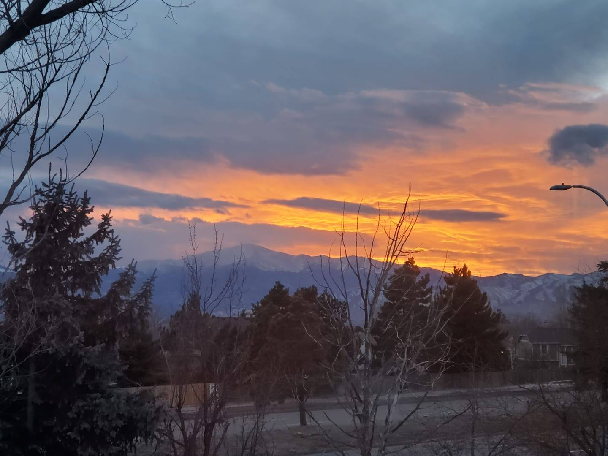
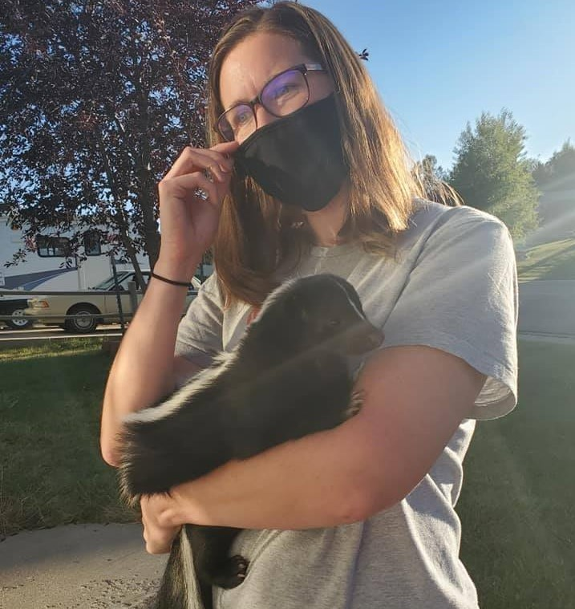
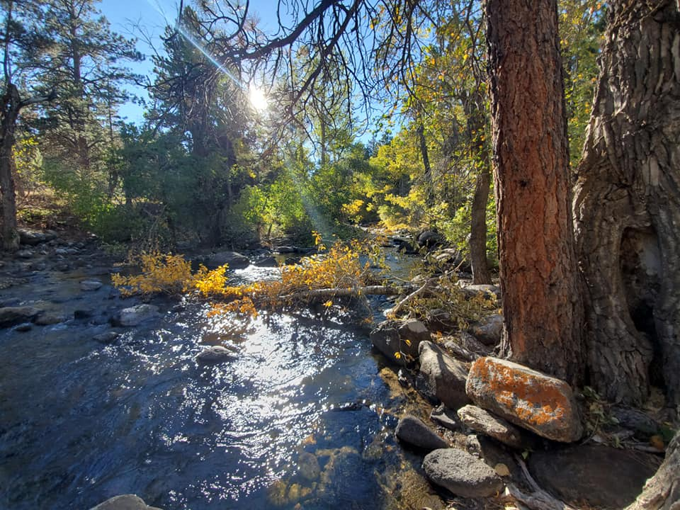
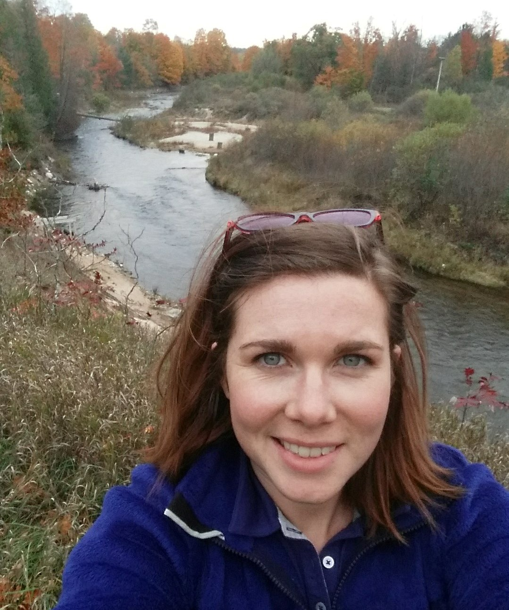
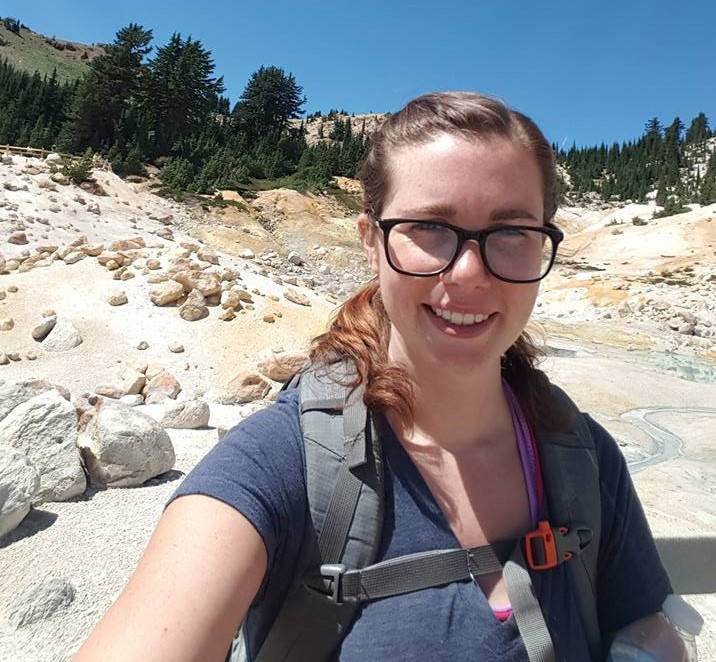

